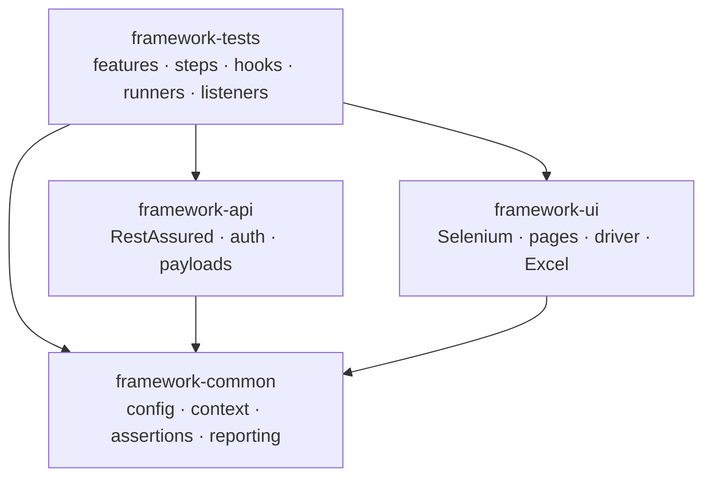

# Unified UI + API Test Automation Framework

A production-grade, multi-module test automation framework that exercises both a
**REST API** (Spotify) and a **web UI** (SauceDemo) through one cohesive,
BDD-driven codebase. Built to demonstrate professional framework architecture:
clean separation of concerns, scenario-scoped dependency injection, parallel
execution, rich reporting, and a full path from local runs to containerized CI.

---

## What this demonstrates

- **One framework, two domains.** API and UI automation share configuration,
  context, assertions, and reporting, while keeping their domain-specific code
  isolated in separate modules.
- **BDD with Cucumber 7**, run on **TestNG** for parallelism and retry.
- **Scenario-scoped dependency injection** via PicoContainer — no static mutable
  state, so parallel scenarios never interfere.
- **Template + JsonPath payloads** for deeply nested APIs without a sprawl of POJOs.
- **Page Object Model** with explicit waits (not Selenium PageFactory).
- **Data-driven UI** via Excel (Apache POI).
- **Parallel execution** (4 scenarios at a time) with **flaky-test retry**.
- **Selenium Grid**, **Docker**, and a **Jenkins pipeline** with secrets in the
  credential store.
- **ExtentReports 5** with request/response logs, stack traces, and failure
  screenshots embedded.

---

## Architecture

The project is a multi-module Maven build. Domain modules depend on a shared
`framework-common`; the `framework-tests` module wires everything together with
features, steps, hooks, and runners.



| Module | Responsibility |
|---|---|
| `framework-common` | Config (OWNER), `TestContext`, hard `AssertionService`, placeholder resolution, Extent reporting, logging. Depends on nothing else. |
| `framework-api` | RestAssured execution, OAuth2 auth (`AuthManager`), JSON-template payloads, JsonPath/schema assertions. |
| `framework-ui` | Selenium driver lifecycle, page objects, Excel data reader. |
| `framework-tests` | Feature files, step definitions, Cucumber hooks, TestNG runners, retry/parallel listeners. The only module with executable tests. |

**Clean architecture rule:** test code never imports RestAssured or Selenium
directly — only through the service and page layers.

---

## Tech stack

| Area | Technology |
|---|---|
| Language / build | Java 17, Maven (multi-module) |
| BDD / runner | Cucumber 7, TestNG (`AbstractTestNGCucumberTests`) |
| DI | PicoContainer (scenario-scoped) |
| API | RestAssured, Jayway JsonPath, JSON Schema Validator |
| UI | Selenium 4, WebDriverManager, Apache POI (Excel) |
| Assertions | AssertJ |
| Config | OWNER |
| Reporting / logging | ExtentReports 5, Log4j2 |
| Test data | Java Faker, Awaitility (async polling) |
| Infra | Selenium Grid, Docker / Docker Compose, Jenkins |

**Targets under test:** Spotify Web API (read + write playlist scenarios) and
SauceDemo (`https://www.saucedemo.com`, full purchase flow).

---

## Project structure

```
unified-framework/
├── pom.xml                          # parent: modules, dependency management, plugins
├── framework-common/
│   └── src/main/java/com/framework/common/
│       ├── config/                  # AppConfig (OWNER), ConfigManager
│       ├── context/                 # TestContext (scenario-scoped state)
│       ├── service/                 # AssertionService (hard), PlaceholderResolver
│       ├── report/                  # ExtentManager, ExtentTestManager (ThreadLocal)
│       └── utils/                   # LogUtils, JsonUtils
├── framework-api/
│   └── src/main/java/com/framework/api/
│       ├── auth/                    # AuthManager (client-credentials + user refresh), TokenCache
│       ├── service/                 # ApiService, ApiAssertionService, PayloadService, ValueParser
│       └── utils/                   # RandomDataUtils, WaitUtils
├── framework-ui/
│   └── src/main/java/com/framework/ui/
│       ├── driver/                  # DriverFactory (local/remote, multi-browser), DriverManager
│       ├── pages/                   # BasePage, Login/Inventory/Cart/Checkout pages, PageManager
│       └── data/                    # ExcelDataReader
├── framework-tests/
│   └── src/test/
│       ├── java/com/framework/tests/
│       │   ├── runner/              # ApiTestRunner, UiTestRunner
│       │   ├── hooks/               # ApiHooks (@api), UiHooks (@ui)
│       │   ├── steps/               # api/, ui/
│       │   └── listener/            # RetryAnalyzer, RetryTransformer, ExtentFlushListener
│       └── resources/
│           ├── features/            # api/, ui/
│           ├── testdata/            # ui-testdata.xlsx
│           ├── testng-api.xml
│           └── testng-ui.xml
├── docker-compose-grid.yml          # Selenium Grid (hub + chromium + firefox)
├── docker-compose.yml               # Grid + containerized test runner
├── Dockerfile                       # test-runner image
├── docker-entrypoint.sh             # waits for Grid, then runs the suite
└── Jenkinsfile                      # CI pipeline
```

---

## Prerequisites

- **JDK 17+** and **Maven 3.9+**
- **Docker + Docker Compose** (for Grid and containerized runs)
- A **Spotify developer app** (client id/secret) and a **user refresh token**
  for the API write scenarios. UI scenarios need nothing — SauceDemo uses fixed
  public demo credentials.

---

## Configuration

Configuration is layered via the OWNER library. Values are resolved in order
(first match wins): **system properties (`-D`) → `config/<env>.properties` →
`config/default.properties`**.

- Select the environment with `-Denv=staging` (defaults to `dev`).
- Override any single value at runtime with `-D`, e.g. `-Dui.headless=true`.

Key settings (all overridable):

| Property | Purpose | Default |
|---|---|---|
| `api.base.url` | Spotify API base | (in properties) |
| `api.auth.*` | OAuth2 client id/secret/refresh token, user id | supply via `-D` |
| `ui.base.url` | SauceDemo URL | `https://www.saucedemo.com` |
| `ui.browser` | chrome / firefox / edge | `chrome` |
| `ui.headless` | run browser headless | `false` |
| `ui.grid.enabled` | run against a Selenium Grid | `false` |
| `ui.grid.url` | Grid hub endpoint | `http://localhost:4444/wd/hub` |
| `retry.count` | flaky-test retries | `2` |

**Credentials are never committed.** Supply them at runtime (`-D`), or — in CI —
from the Jenkins credential store (see the pipeline).

---

## Running the tests

### Unit tests (framework's own)
```bash
mvn clean test -pl framework-common -am
mvn clean test -pl framework-api -am
```

### API tests (Spotify)
```bash
mvn clean test -pl framework-tests -am -Dcucumber.filter.tags="@api" \
    -Dapi.auth.client.id=YOUR_ID \
    -Dapi.auth.client.secret=YOUR_SECRET \
    -Dapi.auth.refresh.token=YOUR_REFRESH_TOKEN \
    -Dapi.user.id=YOUR_USER_ID
```

### UI tests (SauceDemo, local browser)
```bash
mvn clean test -pl framework-tests -am -Dcucumber.filter.tags="@ui"
# headless:        add -Dui.headless=true
# different browser: add -Dui.browser=firefox
```

### UI tests against a Selenium Grid
```bash
docker compose -f docker-compose-grid.yml up -d        # start the Grid
mvn clean test -pl framework-tests -am -Dcucumber.filter.tags="@ui" \
    -Dui.grid.enabled=true -Dui.grid.url=http://localhost:4444/wd/hub -Dui.browser=chrome
docker compose -f docker-compose-grid.yml down         # stop it
```

### Everything in containers
```bash
docker compose up --build      # builds the test image, starts the Grid, runs the UI suite
docker compose down
```

### Selecting what runs

Tests are selected by **Cucumber tags**, not by juggling suite files:

| Tag | Selects |
|---|---|
| `@api` | API scenarios |
| `@ui` | UI scenarios |
| `@smoke` | critical-path subset |
| `@regression` | full UI flow |

Example: `-Dcucumber.filter.tags="@ui and @smoke"`.

---

## Parallelism & retry

- **Parallel execution** is driven by `@DataProvider(parallel = true)` on the
  runners plus `data-provider-thread-count="4"` in the TestNG suites — up to 4
  scenarios run concurrently. Override per run with `-Ddataproviderthreadcount=N`.
- **Thread safety** is structural: `TestContext` is scenario-scoped (PicoContainer),
  the Extent node / WebDriver / Faker are `ThreadLocal`, and the token cache is a
  `ConcurrentHashMap`. No shared mutable state.
- **Retry** rescues flaky failures: `RetryAnalyzer` (an `IRetryAnalyzer`) reruns a
  failed scenario up to `retry.count` times; `RetryTransformer` attaches it to
  every test at runtime. A deterministic failure still fails on every attempt.

---

## Reporting

After a run, open the Extent report:

```
framework-tests/target/reports/extent-report.html
```

It captures, per scenario: tags, environment, pass/fail status, and on failure —
the stack trace, the full request/response interactions (API) or a screenshot
(UI, embedded as base64). The report is flushed once per suite by an
`ISuiteListener` (parallel-safe), and Log4j2 writes a console/file log alongside.

---

## CI/CD (Jenkins)

The `Jenkinsfile` defines a parameterized declarative pipeline:

1. **Checkout → Build** (`mvn install -DskipTests`)
2. **Start Selenium Grid** (Docker Compose, with a readiness wait)
3. **Test** — secrets bound from the **Jenkins credential store** via
   `withCredentials` (masked in logs), injected into Maven
4. **Publish** — Extent HTML report + TestNG/Surefire results; **tear down** the Grid

Parameters: `ENV`, `BROWSER`, `TAGS`. Required Jenkins credentials (Secret text):
`spotify-client-id`, `spotify-client-secret`, `spotify-refresh-token`,
`spotify-user-id`.

---

## Key design decisions

The *why* behind the framework — the decisions worth discussing:

- **Multi-module Maven.** Domain isolation: `framework-api` and `framework-ui`
  never depend on each other; both depend on `framework-common`. Adding a domain
  doesn't touch existing ones.
- **TestNG runner over JUnit.** TestNG owns parallelism (via the data provider)
  and retry (via `IRetryAnalyzer`); Surefire is a thin launcher.
- **PicoContainer, no static state.** Each scenario gets a fresh `TestContext`,
  which is what makes parallel execution safe without locks.
- **Hard assertions.** Assertions fail fast (first failure aborts the scenario),
  with the stack trace captured into `TestContext` and surfaced in the report.
  Trade-off accepted over soft assertions' "collect all failures."
- **Template + JsonPath payloads.** JSON templates are loaded and mutated via
  JsonPath at runtime, avoiding a POJO per endpoint for deeply nested APIs.
- **Two placeholder systems.** Cucumber's `<angle-brackets>` substitute at parse
  time (Scenario Outline); the framework's `${var}` resolves at runtime from
  `scenarioVars` — used for response-value chaining and Excel-driven data alike.
- **Dual-mode OAuth2.** `AuthManager` selects client-credentials (read) or a
  user refresh-token flow (write) per scenario, driven by the `@userAuth` tag.
- **Tag-scoped hooks.** `ApiHooks` (`@api`) and `UiHooks` (`@ui`) both load but
  each fires only for its domain — how two domains share one glue/runner setup.
- **Page Object Model with explicit waits.** Classic `By` locators + `WebDriverWait`
  (not PageFactory/`@FindBy`), for visible, controllable synchronization. A
  `PageManager` shares page objects across step classes within a scenario.
- **Program to the `WebDriver` interface.** `DriverFactory` is the only class that
  knows the concrete browser or local-vs-remote choice; everything else depends on
  the abstraction — which is why adding Grid and multi-browser touched one class.
- **Excel → scenarioVars bridge.** Spreadsheet data lands in the same variable map
  the framework already uses for chaining — one mechanism, reused.

---

## Extending the framework

- **New API endpoint:** add a JSON payload template + a feature file + steps.
- **New UI page:** add a page object (extend `BasePage`) + a getter on `PageManager`.
- **New test case (UI):** add a row to `ui-testdata.xlsx` + an `Examples` line.
- **New browser:** add a `case` to `DriverFactory`.

The design goal throughout: adding a test means adding *data* (a feature, a
template, a spreadsheet row), not framework plumbing.

---

## Known limitations & future work

- **Edge on ARM:** the Edge Grid node has no ARM64 image; local Apple Silicon runs
  use Chromium + Firefox. Edge runs on x86 CI.
- **Per-step failure location:** failures report the scenario line; exact step-line
  reporting would use a custom Cucumber `EventListener`.
- **Cross-browser is sequential** (one browser per run), by design.
- **Secrets as `-D` flags** are masked in logs but briefly visible in the agent
  process list; a file-based or `MAVEN_OPTS` approach hardens this on shared agents.
